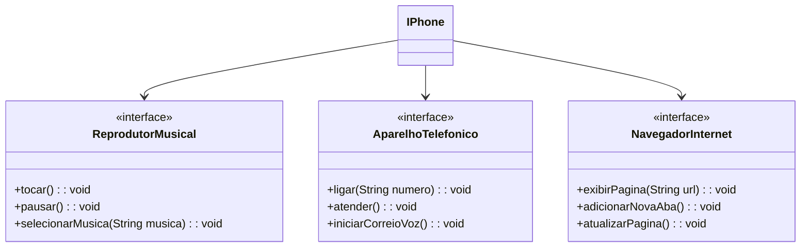

### Representação UML 

```mermaid
classDiagram
    class ReprodutorMusical {
        <<interface>>
        +tocar() : void
        +pausar() : void
        +selecionarMusica(String musica) : void
    }

    class AparelhoTelefonico {
        <<interface>>
        +ligar(String numero) : void
        +atender() : void
        +iniciarCorreioVoz() : void
    }

    class NavegadorInternet {
        <<interface>>
        +exibirPagina(String url) : void
        +adicionarNovaAba() : void
        +atualizarPagina() : void
    }

    class IPhone {
    }

    IPhone --> ReprodutorMusical
    IPhone --> AparelhoTelefonico
    IPhone --> NavegadorInternet
```
